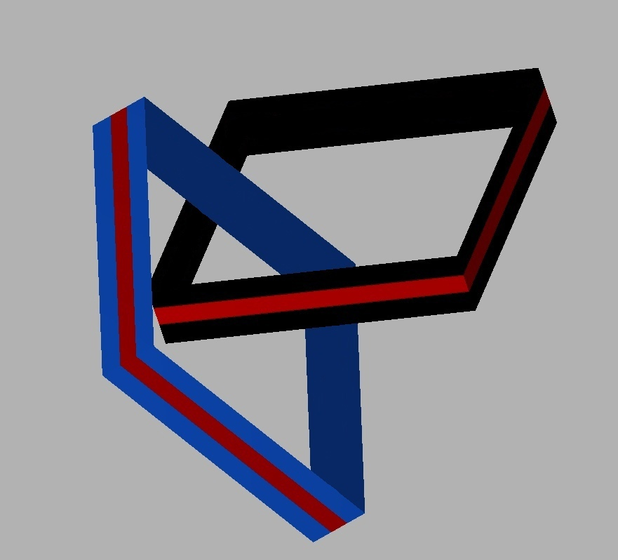
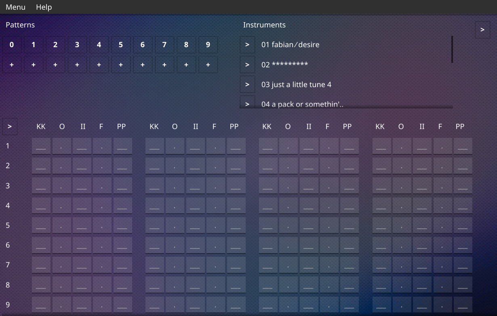
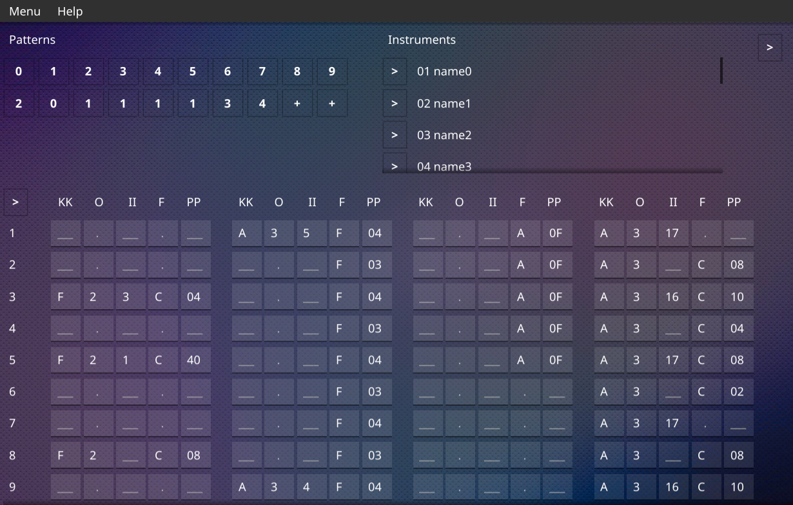

# oyaoya
Tracker music editor





# build

You need golang and gcc compilers installed.                                                
Also for running program you need jvm v=>17                                              
In program folder type:
```
go build main.go
./main
```
---

It includes code from [micromod](https://github.com/martincameron/micromod) by [Martin Cameron](https://github.com/martincameron), which is licensed under the BSD-3-like license.  

Special thanks to [Durasel](https://github.com/durasel74) and [Jorik123890](https://github.com/Jorik123890)
